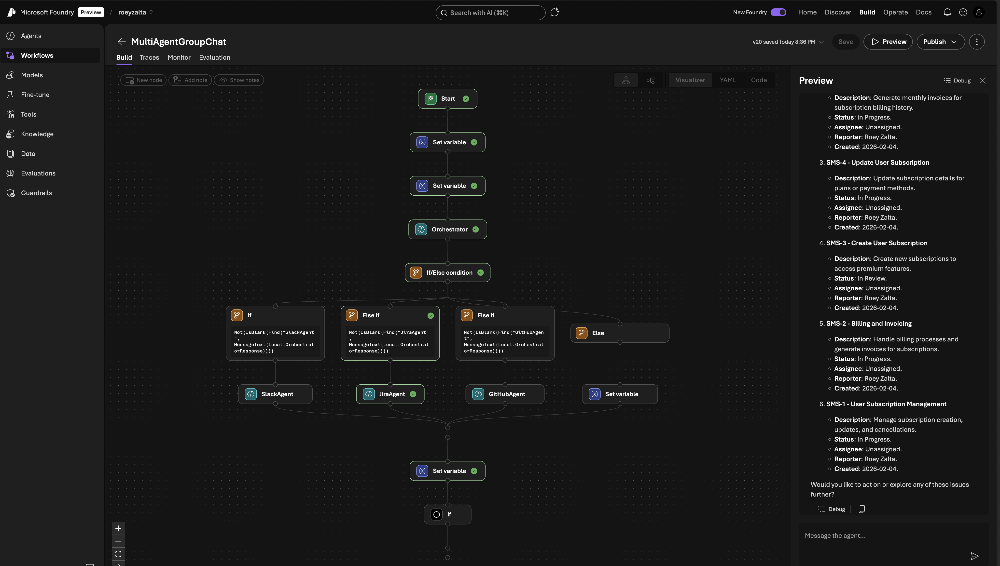

<!--
---
name: Multi-Agent Group Chat using Microsoft Agent Framework
description: A multi-agent orchestration system using the Microsoft Agent Framework SDK with MCP tool servers, deployable locally or as a hosted workflow on Azure AI Foundry.
page_type: sample
languages:
- python
products:
- azure-openai
- azure-api-management
- azure-ai-foundry
urlFragment: multi-agents-poc-maf
---
-->

<p align="center">
  
</p>

# Multi-Agent Group Chat using Microsoft Agent Framework

<p align="center">
  
  &nbsp;&nbsp;&nbsp;
  
  &nbsp;&nbsp;&nbsp;
  
</p>

<p align="center">
  <a href="https://www.python.org/downloads/"></a>
  <a href="https://opensource.org/licenses/MIT"></a>
  <a href="https://ai.azure.com"></a>
  <a href="https://github.com/microsoft/agent-framework"></a>
</p>

A multi-agent group chat system built with the [Microsoft Agent Framework](https://github.com/microsoft/agent-framework) SDK. An **Orchestrator** agent intelligently routes user requests to specialized tool agents — **Slack**, **Jira**, and **GitHub** — each backed by a remote [Model Context Protocol (MCP)](https://modelcontextprotocol.io/) server.

The system supports both **local development** and **cloud deployment** as a hosted workflow on [Azure AI Foundry](https://ai.azure.com).

<p align="center">
  
</p>

<p align="center"><em>The multi-agent workflow running in Azure AI Foundry — the Orchestrator routes a user query to the JiraAgent, which returns matching Jira issues via MCP.</em></p>

## Table of Contents

- [Architecture](#architecture)
- [Features](#features)
- [MCP Tool Servers](#mcp-tool-servers)
- [Project Structure](#project-structure)
- [Prerequisites](#prerequisites)
- [Getting Started](#getting-started)
- [Usage](#usage)
  - [Local Mode](#local-mode)
  - [Azure AI Foundry Deployment](#azure-ai-foundry-deployment)
  - [GitHub MCP Connection Setup](#github-mcp-connection-setup)
- [Evaluation](#evaluation)
- [Key Design Decisions](#key-design-decisions)
- [Known Limitations](#known-limitations)
- [Resources](#resources)

## Architecture

The solution implements a hub-and-spoke orchestration pattern where a central Orchestrator agent analyzes user intent and delegates work to the appropriate specialized agent:

```
                                  ┌──────────────┐
                                  │  SlackAgent   │
                              ┌──>│  (MCP / SSE)  │──> APIM ──> Slack
                              │   └──────────────┘
┌──────┐    ┌──────────────┐  │   ┌──────────────┐
│ User │───>│ Orchestrator │──┼──>│  JiraAgent    │──> APIM ──> Jira
└──────┘    │   (GPT-4o)   │  │   │  (MCP / SSE)  │
            └──────────────┘  │   └──────────────┘
                              │   ┌──────────────┐
                              └──>│ GitHubAgent   │──> GitHub Copilot MCP
                                  │  (MCP / SSE)  │
                                  └──────────────┘
```

| Mode | Entrypoint | How agents connect to MCP servers |
|------|-----------|----------------------------------|
| **Local** | `main.py` | Custom wrappers (`RawMCPSseTool`, `RawMCPStdioTool`) connect directly |
| **Foundry** | `pipeline/publish.py` | Native MCP tool definitions (`type: "mcp"`) — Foundry runtime connects on the agent's behalf |

## Features

- **Intent-based routing** — The Orchestrator analyzes each user message and delegates to the right agent
- **Three specialized agents** — Slack, Jira, and GitHub, each with full MCP tool access
- **Dual execution modes** — Run locally for development or deploy to Azure AI Foundry for production
- **Native MCP integration** — Foundry-hosted agents use native MCP tool definitions for server-side tool execution
- **Secure credential handling** — GitHub MCP auth via Foundry [project connections](https://learn.microsoft.com/azure/ai-studio/how-to/connections-add), not inline secrets
- **Declarative workflow** — Foundry deployment uses a YAML workflow with conditional routing and looping

## MCP Tool Servers

| Server | Transport | Endpoint | Description |
|--------|-----------|----------|-------------|
| **Slack** | SSE via APIM | `https://<apim>.azure-api.net/slack-mcp-1/sse` | Channel listing, message history, posting messages |
| **Jira** | SSE via APIM | `https://<apim>.azure-api.net/jira-mcp-1/sse` | Issue search, project listing, sprint management |
| **GitHub** | SSE (remote) | `https://api.githubcopilot.com/mcp/` | Repository browsing, file access, issue management |

The Slack and Jira MCP servers are hosted behind **Azure API Management** as a remote MCP gateway. For setting up your own APIM-hosted MCP servers, see:

> **[msftse/remote-mcp-apim-functions-python](https://github.com/msftse/remote-mcp-apim-functions-python)** — Deploy remote MCP servers on Azure Functions and Container Apps behind an APIM gateway with OAuth 2.0 authentication.

GitHub uses the hosted [GitHub Copilot MCP endpoint](https://docs.github.com/en/copilot/building-copilot-extensions/building-a-copilot-agent/using-the-model-context-protocol-for-copilot-agents) directly, authenticated via a Foundry project connection.

## Project Structure

```
.
├── main.py                        # Local entrypoint — interactive or single-task mode
├── pyproject.toml                 # Project metadata and dependencies
├── .env.example                   # Environment variable template
│
├── evaluation/                    # Agent evaluation suite
│   ├── run_evaluation.py          # Evaluation runner (routing + tool call accuracy)
│   ├── evaluation_data.jsonl      # 40 test cases across all agents
│   └── tool_definitions.json      # MCP tool schemas for all agents
│
├── pipeline/                      # Azure AI Foundry deployment
│   ├── agents.py                  # Agent factories using native MCP tool definitions
│   ├── publish.py                 # CLI: register, deploy, verify, and run workflows
│   └── workflow.yaml              # Declarative workflow with conditional routing
│
└── src/                           # Core application code
    ├── config.py                  # Centralized configuration from .env
    ├── workflow.py                # Programmatic GroupChat builder (local mode)
    ├── prompts/                   # Agent names, instructions, and descriptions
    │   ├── orchestrator.py
    │   ├── slack.py
    │   ├── jira.py
    │   └── github.py
    ├── agents/                    # Local agent factories with MCP wrappers
    │   ├── orchestrator.py
    │   ├── slack_agent.py
    │   ├── jira_agent.py
    │   └── github_agent.py
    └── tools/                     # MCP transport wrappers
        ├── raw_mcp_sse.py         # SSE transport (Slack, Jira via APIM)
        └── raw_mcp_stdio.py       # Stdio transport (GitHub MCP server binary)
```

## Prerequisites

- **Python 3.10+**
- **Azure OpenAI** resource with a `gpt-4o` (or equivalent) model deployment
- **MCP servers** accessible via APIM (Slack, Jira) or remotely (GitHub) — see [MCP Tool Servers](#mcp-tool-servers)
- **Azure AI Foundry project** with `DefaultAzureCredential` access *(for cloud deployment only)*

## Getting Started

### 1. Clone the repository and install dependencies

```bash
git clone https://github.com/<your-org>/multi-agents-poc-maf.git
cd multi-agents-poc-maf
pip install -e .
```

### 2. Configure environment variables

```bash
cp .env.example .env
```

Edit `.env` and fill in your values. See `.env.example` for the full list.

#### Required Variables

| Variable | Description |
|----------|-------------|
| `AZURE_OPENAI_ENDPOINT` | Your Azure OpenAI resource endpoint |
| `AZURE_OPENAI_API_KEY` | Azure OpenAI API key |
| `SLACK_MCP_SSE_URL` | APIM-hosted Slack MCP SSE endpoint |
| `JIRA_MCP_SSE_URL` | APIM-hosted Jira MCP SSE endpoint |
| `GITHUB_PERSONAL_ACCESS_TOKEN` | GitHub Personal Access Token for MCP auth |

#### Required for Foundry Deployment

| Variable | Description |
|----------|-------------|
| `AZURE_AI_PROJECT_ENDPOINT` | Azure AI Foundry project endpoint |
| `AZURE_SUBSCRIPTION_ID` | Azure subscription ID |
| `AZURE_AI_RESOURCE_GROUP` | Resource group containing the Foundry project |
| `AZURE_AI_PROJECT_NAME` | Foundry project name |

## Usage

### Local Mode

Run the multi-agent group chat locally. The orchestrator routes your request to the appropriate agent, which connects directly to the MCP server.

```bash
# Interactive mode
python main.py

# Single task
python main.py "List my Slack channels"
python main.py "What Jira tickets are assigned to me?"
python main.py "List my GitHub repositories"
```

### Azure AI Foundry Deployment

Register agents and deploy the workflow to Azure AI Foundry as a hosted agent visible and runnable in the Foundry UI.

```bash
# Step 1: Register agents and workflow definition in Foundry
python -m pipeline.publish --register

# Step 2: Deploy via ARM API (creates Application + AgentDeployment)
python -m pipeline.publish --deploy

# Step 3: Verify the deployed workflow responds
python -m pipeline.publish --verify
```

You can also register agents in Foundry and run a task locally through the Foundry provider:

```bash
python -m pipeline.publish --run "Show my recent Slack messages"
```

### GitHub MCP Connection Setup

The GitHub MCP server requires authentication via a **Foundry project connection** (not inline headers — Foundry rejects those). Create a `CustomKeys` connection in your Foundry project:

**Option 1: Azure Portal**

1. Navigate to your AI Foundry project in the [Azure Portal](https://portal.azure.com).
2. Go to **Connected resources** > **+ New connection** > **Custom Keys**.
3. Set **Credential name** to `Authorization` and **Credential value** to `Bearer <your-github-pat>`.
4. Name the connection `github-mcp-pat`.

**Option 2: Azure CLI**

```bash
az rest --method put \
  --url "https://management.azure.com/<your-project-resource-id>/connections/github-mcp-pat?api-version=2025-04-01-preview" \
  --body '{
    "properties": {
      "authType": "CustomKeys",
      "category": "CustomKeys",
      "target": "https://api.githubcopilot.com/mcp/",
      "isSharedToAll": true,
      "credentials": {
        "keys": {
          "Authorization": "Bearer <your-github-pat>"
        }
      }
    }
  }'
```

> **Note:** The `project_connection_id` field in the native MCP tool definition takes the connection **name** (e.g., `github-mcp-pat`), not the full ARM resource ID.

## Evaluation

The project includes an evaluation suite that uses the [Azure AI Evaluation SDK](https://learn.microsoft.com/azure/ai-foundry/how-to/develop/agent-evaluate-sdk) to measure agent quality:

| Evaluator | What it measures |
|-----------|-----------------|
| `IntentResolutionEvaluator` | Does the Orchestrator correctly identify user intent and route to the right agent? |
| `ToolCallAccuracyEvaluator` | Does the sub-agent select the correct MCP tools for the query? |

### Install evaluation dependencies

```bash
pip install -e ".[eval]"
```

### Run evaluations

```bash
# Orchestrator routing + tool call accuracy (individual evaluators)
python -m evaluation.run_evaluation

# Orchestrator routing only
python -m evaluation.run_evaluation --routing-only

# Tool call accuracy only
python -m evaluation.run_evaluation --tool-calls-only

# Batch mode using SDK evaluate() function
python -m evaluation.run_evaluation --batch

# Log results to Azure AI Foundry
python -m evaluation.run_evaluation --batch --log-to-foundry
```

### Evaluation dataset

The dataset (`evaluation/evaluation_data.jsonl`) contains 40 test cases across four categories:

| Category | Count | Description |
|----------|-------|-------------|
| Slack routing | 10 | Queries that should route to SlackAgent |
| Jira routing | 12 | Queries that should route to JiraAgent |
| GitHub routing | 12 | Queries that should route to GitHubAgent |
| Multi-agent | 6 | Multi-step queries testing first-hop routing |

Each test case specifies the expected agent and expected tool calls, enabling automated accuracy measurement.

### Evaluation files

| File | Description |
|------|-------------|
| `evaluation/evaluation_data.jsonl` | Test dataset with queries, expected agents, and expected tools |
| `evaluation/tool_definitions.json` | Full tool schemas for all three MCP servers |
| `evaluation/run_evaluation.py` | Evaluation runner script |

## Key Design Decisions

| Decision | Rationale |
|----------|-----------|
| **Native MCP tool dicts for Foundry** | Tool agents use raw `type: "mcp"` dictionaries (not `FunctionTool` wrappers) so the Foundry runtime connects to MCP servers at execution time. This is required because Foundry rejects inline auth headers containing sensitive data. |
| **Dual execution modes** | Local mode uses custom MCP wrappers (`RawMCPSseTool`, `RawMCPStdioTool`) for direct connections; Foundry mode uses native MCP tool definitions. Both share the same prompts and configuration. |
| **Project connections for auth** | GitHub MCP auth uses a Foundry `CustomKeys` connection rather than inline headers, following Foundry's security model for sensitive credentials. |
| **Declarative workflow YAML** | The Foundry deployment uses `ConditionGroup` for intent-based routing and `kind: If` with `GotoAction` for multi-round looping, keeping orchestration logic declarative and version-controlled. |
| **Centralized configuration** | All settings flow through a typed `Config` dataclass in `src/config.py`, loaded from `.env` via `load_config()`. |

## Known Limitations

- **Multi-step routing**: The loop mechanism (`GotoAction`) does not reliably fire after the first sub-agent completes in the Foundry-hosted workflow. Single-agent routing per user turn works correctly.
- **SDK preview**: This project uses pre-release versions of the Microsoft Agent Framework SDK. APIs may change in future releases.

## Resources

- [Microsoft Agent Framework](https://github.com/microsoft/agent-framework) — The SDK used to build and orchestrate agents
- [Azure AI Foundry](https://ai.azure.com) — Cloud platform for deploying and managing AI agents
- [Model Context Protocol (MCP)](https://modelcontextprotocol.io/) — Open protocol for connecting AI models to external tools
- [Remote MCP Servers with APIM](https://github.com/msftse/remote-mcp-apim-functions-python) — Reference implementation for APIM-hosted MCP servers
- [GitHub Copilot MCP](https://docs.github.com/en/copilot/building-copilot-extensions/building-a-copilot-agent/using-the-model-context-protocol-for-copilot-agents) — GitHub's hosted MCP endpoint
- [Azure API Management](https://learn.microsoft.com/azure/api-management/) — AI Gateway for MCP server backends
