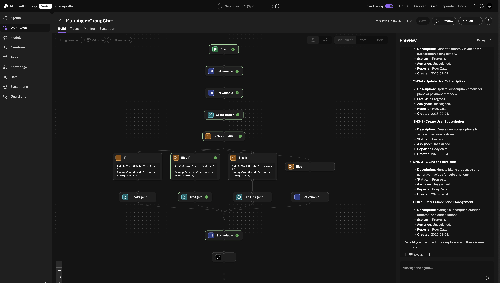

<!--
---
name: Multi-Agent Group Chat using Microsoft Agent Framework
description: A multi-agent orchestration system using the Microsoft Agent Framework SDK with MCP tool servers, deployable locally or as a hosted workflow on Azure AI Foundry.
page_type: sample
languages:
- python
products:
- azure-openai
- azure-api-management
- azure-ai-foundry
urlFragment: multi-agents-poc-maf
---
-->

<p align="center">
  
</p>

# Multi-Agent Group Chat using Microsoft Agent Framework

<p align="center">
  
  &nbsp;&nbsp;&nbsp;
  
  &nbsp;&nbsp;&nbsp;
  
</p>

<p align="center">
  <a href="https://www.python.org/downloads/"></a>
  <a href="https://opensource.org/licenses/MIT"></a>
  <a href="https://ai.azure.com"></a>
  <a href="https://github.com/microsoft/agent-framework"></a>
</p>

A multi-agent group chat system built with the [Microsoft Agent Framework](https://github.com/microsoft/agent-framework) SDK. An **Orchestrator** agent intelligently routes user requests to specialized tool agents — **Slack**, **Jira**, and **GitHub** — each backed by a remote [Model Context Protocol (MCP)](https://modelcontextprotocol.io/) server.

The system supports both **local development** and **cloud deployment** as a hosted workflow on [Azure AI Foundry](https://ai.azure.com).

<p align="center">
  
</p>

<p align="center"><em>The multi-agent workflow running in Azure AI Foundry — the Orchestrator routes a user query to the JiraAgent, which returns matching Jira issues via MCP.</em></p>

## Table of Contents

- [Architecture](#architecture)
- [Features](#features)
- [MCP Tool Servers](#mcp-tool-servers)
- [Project Structure](#project-structure)
- [Prerequisites](#prerequisites)
- [Getting Started](#getting-started)
- [Usage](#usage)
  - [Local Mode](#local-mode)
  - [Azure AI Foundry Deployment](#azure-ai-foundry-deployment)
  - [GitHub MCP Connection Setup](#github-mcp-connection-setup)
- [CI/CD](#cicd)
- [Evaluation](#evaluation)
- [Key Design Decisions](#key-design-decisions)
- [Known Limitations](#known-limitations)
- [Resources](#resources)

## Architecture

The project supports two orchestration patterns that share the same agents and MCP tools:

### Sequential (Group Chat)

A hub-and-spoke pattern where the Orchestrator delegates to **one agent at a time** in a loop:

```
                                  ┌──────────────┐
                                  │  SlackAgent   │
                              ┌──>│  (MCP / SSE)  │──> APIM ──> Slack
                              │   └──────────────┘
┌──────┐    ┌──────────────┐  │   ┌──────────────┐
│ User │───>│ Orchestrator │──┼──>│  JiraAgent    │──> APIM ──> Jira
└──────┘    │   (GPT-4o)   │  │   │  (MCP / SSE)  │
            └──────────────┘  │   └──────────────┘
                              │   ┌──────────────┐
                              └──>│ GitHubAgent   │──> GitHub Copilot MCP
                                  │  (MCP / SSE)  │
                                  └──────────────┘
```

### Parallel (Fan-out / Fan-in)

The Orchestrator selects **multiple agents at once**, they all execute, and a Synthesizer combines their results into a single final answer:

```
                              ┌──────────────┐
                          ┌──>│  SlackAgent   │──┐
                          │   └──────────────┘   │
┌──────┐    ┌─────────┐  │   ┌──────────────┐   │   ┌──────────────┐
│ User │───>│ Router  │──┼──>│  JiraAgent    │──┼──>│ Synthesizer  │───> Final Answer
└──────┘    │(GPT-4o) │  │   └──────────────┘   │   │   (GPT-4o)   │
            └─────────┘  │   ┌──────────────┐   │   └──────────────┘
                          └──>│ GitHubAgent   │──┘
                              └──────────────┘
```

| Mode | Entrypoint | How agents connect to MCP servers |
|------|-----------|----------------------------------|
| **Local (Sequential)** | `main.py` | Custom wrappers (`RawMCPSseTool`, `RawMCPStdioTool`) connect directly |
| **Local (Parallel)** | `main_parallel.py` | Same wrappers, agents run concurrently via `asyncio.gather` |
| **Foundry (Sequential)** | `pipeline/publish.py` | Native MCP tool definitions (`type: "mcp"`) — Foundry runtime connects on the agent's behalf |
| **Foundry (Parallel)** | `pipeline/publish_parallel.py` | Same native MCP tools, fan-out via conditional agent invocation |

## Features

- **Two orchestration patterns** — Sequential (group chat) for iterative multi-turn routing, and parallel (fan-out/fan-in) for concurrent multi-agent execution with synthesized results
- **Intent-based routing** — The Orchestrator analyzes each user message and delegates to the right agent(s)
- **Three specialized agents** — Slack, Jira, and GitHub, each with full MCP tool access
- **Dual execution modes** — Run locally for development or deploy to Azure AI Foundry for production
- **Native MCP integration** — Foundry-hosted agents use native MCP tool definitions for server-side tool execution
- **Secure credential handling** — GitHub MCP auth via Foundry [project connections](https://learn.microsoft.com/azure/ai-studio/how-to/connections-add), not inline secrets
- **Declarative workflow** — Foundry deployment uses YAML workflows with conditional routing

## MCP Tool Servers

| Server | Transport | Endpoint | Description |
|--------|-----------|----------|-------------|
| **Slack** | SSE via APIM | `https://<apim>.azure-api.net/slack-mcp-1/sse` | Channel listing, message history, posting messages |
| **Jira** | SSE via APIM | `https://<apim>.azure-api.net/jira-mcp-1/sse` | Issue search, project listing, sprint management |
| **GitHub** | SSE (remote) | `https://api.githubcopilot.com/mcp/` | Repository browsing, file access, issue management |

The Slack and Jira MCP servers are hosted behind **Azure API Management** as a remote MCP gateway. For setting up your own APIM-hosted MCP servers, see:

> **[msftse/remote-mcp-apim-functions-python](https://github.com/msftse/remote-mcp-apim-functions-python)** — Deploy remote MCP servers on Azure Functions and Container Apps behind an APIM gateway with OAuth 2.0 authentication.

GitHub uses the hosted [GitHub Copilot MCP endpoint](https://docs.github.com/en/copilot/building-copilot-extensions/building-a-copilot-agent/using-the-model-context-protocol-for-copilot-agents) directly, authenticated via a Foundry project connection.

## Project Structure

```
.
├── main.py                        # Local entrypoint — sequential group chat
├── main_parallel.py               # Local entrypoint — parallel fan-out/fan-in
├── pyproject.toml                 # Project metadata and dependencies
├── .env.example                   # Environment variable template
│
├── .github/workflows/
│   └── ci-cd.yml                  # GitHub Actions: lint → deploy → evaluate
│
├── evaluation/                    # Agent evaluation suite
│   ├── run_evaluation.py          # Agent target evaluation runner
│   ├── agent_eval_data.jsonl      # 40 query-only test cases for live eval
│   ├── evaluation_data.jsonl      # Full test cases with expected agents & tools
│   └── tool_definitions.json      # MCP tool schemas for all agents
│
├── pipeline/                      # Azure AI Foundry deployment
│   ├── agents.py                  # Agent factories — sequential workflow
│   ├── publish.py                 # CLI: register/deploy/verify — sequential
│   ├── workflow.yaml              # Declarative workflow — sequential routing
│   ├── parallel_agents.py         # Agent factories — parallel workflow (Router + Synthesizer + 3 tool agents)
│   ├── publish_parallel.py        # CLI: register/deploy/verify — parallel
│   └── parallel_workflow.yaml     # Declarative workflow — fan-out via 3 ConditionGroups
│
└── src/                           # Core application code
    ├── config.py                  # Centralized configuration from .env
    ├── workflow.py                # GroupChat builder (sequential, local mode)
    ├── parallel_workflow.py       # Fan-out/fan-in builder (parallel, local mode)
    ├── prompts/                   # Agent names, instructions, and descriptions
    │   ├── orchestrator.py        # Sequential orchestrator prompt
    │   ├── parallel_orchestrator.py # Router + Synthesizer prompts
    │   ├── slack.py
    │   ├── jira.py
    │   └── github.py
    ├── agents/                    # Local agent factories with MCP wrappers
    │   ├── orchestrator.py        # Sequential orchestrator factory
    │   ├── parallel_orchestrator.py # Router + Synthesizer factories
    │   ├── slack_agent.py
    │   ├── jira_agent.py
    │   └── github_agent.py
    └── tools/                     # MCP transport wrappers
        ├── raw_mcp_sse.py         # SSE transport (Slack, Jira via APIM)
        └── raw_mcp_stdio.py       # Stdio transport (GitHub MCP server binary)
```

## Prerequisites

- **Python 3.10+**
- **Azure OpenAI** resource with a `gpt-4o` (or equivalent) model deployment
- **MCP servers** accessible via APIM (Slack, Jira) or remotely (GitHub) — see [MCP Tool Servers](#mcp-tool-servers)
- **Azure AI Foundry project** with `DefaultAzureCredential` access *(for cloud deployment only)*

## Getting Started

### 1. Clone the repository and install dependencies

```bash
git clone https://github.com/<your-org>/multi-agents-poc-maf.git
cd multi-agents-poc-maf
pip install -e .
```

### 2. Configure environment variables

```bash
cp .env.example .env
```

Edit `.env` and fill in your values. See `.env.example` for the full list.

#### Required Variables

| Variable | Description |
|----------|-------------|
| `AZURE_OPENAI_ENDPOINT` | Your Azure OpenAI resource endpoint |
| `AZURE_OPENAI_API_KEY` | Azure OpenAI API key |
| `SLACK_MCP_SSE_URL` | APIM-hosted Slack MCP SSE endpoint |
| `JIRA_MCP_SSE_URL` | APIM-hosted Jira MCP SSE endpoint |
| `GITHUB_PERSONAL_ACCESS_TOKEN` | GitHub Personal Access Token for MCP auth |

#### Required for Foundry Deployment

| Variable | Description |
|----------|-------------|
| `AZURE_AI_PROJECT_ENDPOINT` | Azure AI Foundry project endpoint |
| `AZURE_SUBSCRIPTION_ID` | Azure subscription ID |
| `AZURE_AI_RESOURCE_GROUP` | Resource group containing the Foundry project |
| `AZURE_AI_PROJECT_NAME` | Foundry project name |

## Usage

### Local Mode

Run the multi-agent system locally. Choose **sequential** (group chat) or **parallel** (fan-out/fan-in) mode.

#### Sequential (Group Chat)

The orchestrator routes your request to one agent at a time in a loop:

```bash
# Interactive mode
python main.py

# Single task
python main.py "List my Slack channels"
python main.py "What Jira tickets are assigned to me?"
python main.py "List my GitHub repositories"
```

#### Parallel (Fan-out / Fan-in)

The router selects multiple agents at once, they execute concurrently, and the synthesizer combines results:

```bash
# Interactive mode
python main_parallel.py

# Single task — multi-agent queries benefit most from parallel execution
python main_parallel.py "List Slack channels and Jira projects"
python main_parallel.py "Show my GitHub repos and recent Slack messages"
```

### Azure AI Foundry Deployment

Register agents and deploy workflows to Azure AI Foundry as hosted agents visible in the Foundry UI.

#### Sequential Workflow

```bash
# Register agents and workflow
python -m pipeline.publish --register

# Deploy via ARM API
python -m pipeline.publish --deploy

# Verify the deployed workflow
python -m pipeline.publish --verify
```

#### Parallel Workflow

```bash
# Register agents (Router, Synthesizer, 3 tool agents) and workflow
python -m pipeline.publish_parallel --register

# Deploy via ARM API
python -m pipeline.publish_parallel --deploy

# Verify the deployed workflow
python -m pipeline.publish_parallel --verify
```

You can also register agents in Foundry and run a task locally through the Foundry provider:

```bash
# Sequential
python -m pipeline.publish --run "Show my recent Slack messages"

# Parallel
python -m pipeline.publish_parallel --run "List Slack channels and Jira projects"
```

### GitHub MCP Connection Setup

The GitHub MCP server requires authentication via a **Foundry project connection** (not inline headers — Foundry rejects those). Create a `CustomKeys` connection in your Foundry project:

**Option 1: Azure Portal**

1. Navigate to your AI Foundry project in the [Azure Portal](https://portal.azure.com).
2. Go to **Connected resources** > **+ New connection** > **Custom Keys**.
3. Set **Credential name** to `Authorization` and **Credential value** to `Bearer <your-github-pat>`.
4. Name the connection `github-mcp-pat`.

**Option 2: Azure CLI**

```bash
az rest --method put \
  --url "https://management.azure.com/<your-project-resource-id>/connections/github-mcp-pat?api-version=2025-04-01-preview" \
  --body '{
    "properties": {
      "authType": "CustomKeys",
      "category": "CustomKeys",
      "target": "https://api.githubcopilot.com/mcp/",
      "isSharedToAll": true,
      "credentials": {
        "keys": {
          "Authorization": "Bearer <your-github-pat>"
        }
      }
    }
  }'
```

> **Note:** The `project_connection_id` field in the native MCP tool definition takes the connection **name** (e.g., `github-mcp-pat`), not the full ARM resource ID.

## CI/CD

The repository includes a GitHub Actions pipeline (`.github/workflows/ci-cd.yml`) that automates linting, deployment, and evaluation:

```
Lint  ──>  Deploy to Foundry  ──>  Evaluate Workflow
```

| Stage | Trigger | What it does |
|-------|---------|-------------|
| **Lint** | Push, PR, manual | Runs `ruff check` and `ruff format --check` |
| **Deploy** | Push to `main`, manual | Registers agents & workflow in Foundry, deploys via ARM API, runs a smoke test. The deploy step exposes the freshly registered agent version (e.g. `MultiAgentGroupChat:21`) as a job output. |
| **Evaluate** | Push to `main`, manual | Runs the official [`microsoft/ai-agent-evals`](https://github.com/microsoft/ai-agent-evals) GitHub Action against the version just deployed. Results land in two places: the workflow's **Evaluation** tab in Foundry, and the **GitHub Actions run summary** with confidence intervals and (when multiple agent versions are passed) pairwise statistical comparison. |

> **Note:** On pull requests, only the Lint stage runs. Deploy and Evaluate require a push to `main` or a manual trigger.

> **Why the official Action?** The `microsoft/ai-agent-evals` Action is the canonical Microsoft path for evaluating Foundry agents in CI/CD — it handles dataset upload, the `azure_ai_agent` target, evaluator wiring (including auto-mapping `tool_definitions` for tool-call evaluators), polling, and report rendering for you. See [Run evaluations in GitHub Actions](https://learn.microsoft.com/azure/foundry/how-to/evaluation-github-action) on Microsoft Learn.

### Required GitHub Secrets

Configure these in **Settings > Secrets and variables > Actions**:

| Secret | Description |
|--------|-------------|
| `AZURE_CREDENTIALS` | Service principal JSON (from `az ad sp create-for-rbac --json-auth`) |
| `AZURE_AI_PROJECT_ENDPOINT` | Foundry project endpoint (`https://<account>.services.ai.azure.com/api/projects/<project>`) |
| `AZURE_OPENAI_ENDPOINT` | Azure OpenAI resource endpoint |
| `AZURE_OPENAI_API_KEY` | Azure OpenAI API key |
| `AZURE_OPENAI_CHAT_DEPLOYMENT_NAME` | Model deployment name (e.g. `gpt-4o`) |
| `AZURE_AI_MODEL_DEPLOYMENT_NAME` | Foundry model deployment name |
| `AZURE_SUBSCRIPTION_ID` | Azure subscription ID |
| `AZURE_RESOURCE_GROUP` | General resource group |
| `AZURE_AI_RESOURCE_GROUP` | Resource group containing the Foundry project |
| `AZURE_AI_PROJECT_NAME` | Foundry project name |
| `SLACK_MCP_SSE_URL` | APIM-hosted Slack MCP SSE endpoint |
| `JIRA_MCP_SSE_URL` | APIM-hosted Jira MCP SSE endpoint |
| `GH_PAT` | GitHub Personal Access Token for MCP auth |
| `GH_MCP_URL` | GitHub Copilot MCP endpoint |

### Service Principal Roles

The service principal used for CI/CD needs the following roles on the **Cognitive Services account** that backs your Foundry project:

| Role | Why |
|------|-----|
| **Contributor** | ARM-level operations (deploy workflow, manage resources) |
| **Cognitive Services User** | Data-plane operations (`agents/write`, `agents/read`). Required because agent CRUD uses data actions under `Microsoft.CognitiveServices/accounts/AIServices/*`, which are not covered by Contributor or Azure AI Developer. |

Assign them with:

```bash
# Contributor on the subscription (or scope to resource group)
az role assignment create \
  --assignee <service-principal-client-id> \
  --role "Contributor" \
  --scope /subscriptions/<subscription-id>

# Cognitive Services User on the Cognitive Services account
az role assignment create \
  --assignee <service-principal-client-id> \
  --role "Cognitive Services User" \
  --scope /subscriptions/<subscription-id>/resourceGroups/<rg>/providers/Microsoft.CognitiveServices/accounts/<account>
```

### Manual trigger

You can trigger the pipeline manually via **Actions > CI/CD > Run workflow**, with an option to skip the evaluation step.

## Evaluation

The project ships two ways to evaluate the deployed **MultiAgentGroupChat** workflow. Both target the live agent through the [Foundry cloud evaluation API](https://learn.microsoft.com/azure/foundry/how-to/develop/cloud-evaluation) and publish results to the workflow's **Evaluation** tab in the Foundry portal.

| Path | Use when | How |
|------|----------|-----|
| **Official GitHub Action** (recommended in CI/CD) | Running evals on every push / PR / nightly schedule | [`microsoft/ai-agent-evals`](https://learn.microsoft.com/azure/foundry/how-to/evaluation-github-action) — driven by `evaluation/agent-eval-dataset.json` |
| **Python SDK script** (recommended for local dev) | Iterating on evaluator config, exploring the cloud-evaluation SDK | `python -m evaluation.run_evaluation` |

### Evaluators

The CI/CD dataset (`evaluation/agent-eval-dataset.json`) wires up twelve built-in evaluators that together give a production-readiness signal:

| Category | Evaluator | What it measures |
|----------|-----------|-----------------|
| Agent behavior | `builtin.intent_resolution` | Does the agent identify the user's intent? |
| Agent behavior | `builtin.task_adherence` | Does the response adhere to the agent's assigned task? |
| Agent behavior | `builtin.task_completion` | Did the agent complete the task end-to-end? |
| Tool usage | `builtin.tool_call_accuracy` | Did the agent call the right MCP tools with correct parameters? |
| Tool usage | `builtin.tool_selection` | Did the agent select the necessary tool(s) at all? |
| Tool usage | `builtin.tool_call_success` | Did tool calls succeed without technical errors? |
| Quality | `builtin.coherence` | Is the response logically coherent? |
| Quality | `builtin.fluency` | Is the response well-written? |
| Safety | `builtin.violence`, `builtin.hate_unfairness`, `builtin.self_harm`, `builtin.sexual` | Does the agent emit unsafe content? |

### Path 1 — Official Microsoft Action (CI/CD)

The workflow already wires this up. Each push to `main` runs the official Action against the version just deployed and renders a summary table in the GitHub Actions run:

```yaml
- name: Run Microsoft AI Agent Evaluation
  uses: microsoft/ai-agent-evals@v3-beta
  with:
    azure-ai-project-endpoint: ${{ secrets.AZURE_AI_PROJECT_ENDPOINT }}
    deployment-name: ${{ secrets.AZURE_AI_MODEL_DEPLOYMENT_NAME }}
    agent-ids: ${{ needs.deploy.outputs.agent_id }}    # e.g. MultiAgentGroupChat:21
    data-path: ${{ github.workspace }}/evaluation/agent-eval-dataset.json
```

The Action handles dataset upload, evaluator wiring (including auto-mapping `tool_definitions` for tool-call evaluators), polling, and rendering. To compare two versions side-by-side with statistical significance testing, pass them comma-separated:

```yaml
agent-ids: "MultiAgentGroupChat:20,MultiAgentGroupChat:21"
```

### Path 2 — Python SDK script (local dev)

```bash
pip install -e ".[eval]"
python -m evaluation.run_evaluation
```

`evaluation/run_evaluation.py` is a self-contained example of the underlying [`azure-ai-projects` cloud-evaluation SDK](https://learn.microsoft.com/azure/foundry/how-to/develop/cloud-evaluation) — it creates an `azure_ai_target_completions` data source with an `azure_ai_agent` target, attaches three evaluators (`intent_resolution`, `tool_call_accuracy`, `task_adherence`), polls for completion, and saves detailed results to `evaluation/agent_eval_results.json`. Use this as a reference when you need fine-grained control the Action doesn't expose (custom evaluator parameters, the `azure_ai_responses` flow for evaluating past responses by ID, etc.).

### Viewing results

- **Foundry portal** — Open your workflow in [Foundry](https://ai.azure.com) and go to the **Evaluation** tab.
- **GitHub Actions summary** — The Action posts a per-evaluator score table with confidence intervals directly under the workflow run.

### Evaluation dataset

40 queries across four categories:

| Category | Count | Routing target |
|----------|-------|----------------|
| Slack | 10 | SlackAgent |
| Jira | 12 | JiraAgent |
| GitHub | 12 | GitHubAgent |
| Multi-agent | 6 | Multi-step queries testing first-hop routing |

### Evaluation files

| File | Description |
|------|-------------|
| `evaluation/agent-eval-dataset.json` | CI/CD dataset consumed by `microsoft/ai-agent-evals` (queries + evaluator list) |
| `evaluation/agent_eval_data.jsonl` | Query-only dataset used by the Python SDK script |
| `evaluation/evaluation_data.jsonl` | Full dataset with expected agents, tools, and arguments (for offline analysis) |
| `evaluation/tool_definitions.json` | MCP tool schemas for all three agents |
| `evaluation/run_evaluation.py` | Cloud-evaluation SDK example (Path 2) |

## Key Design Decisions

| Decision | Rationale |
|----------|-----------|
| **Native MCP tool dicts for Foundry** | Tool agents use raw `type: "mcp"` dictionaries (not `FunctionTool` wrappers) so the Foundry runtime connects to MCP servers at execution time. This is required because Foundry rejects inline auth headers containing sensitive data. |
| **Dual execution modes** | Local mode uses custom MCP wrappers (`RawMCPSseTool`, `RawMCPStdioTool`) for direct connections; Foundry mode uses native MCP tool definitions. Both share the same prompts and configuration. |
| **Project connections for auth** | GitHub MCP auth uses a Foundry `CustomKeys` connection rather than inline headers, following Foundry's security model for sensitive credentials. |
| **Declarative workflow YAML** | The Foundry deployment uses `ConditionGroup` for intent-based routing and `kind: If` with `GotoAction` for multi-round looping, keeping orchestration logic declarative and version-controlled. |
| **Parallel fan-out/fan-in** | The parallel workflow uses a Router agent to select agents upfront, invokes them concurrently (locally via `asyncio.gather`, in Foundry via 3 independent `ConditionGroup` blocks), and a Synthesizer combines all results into a single comprehensive answer. Foundry YAML lacks a native parallel primitive, so independent `ConditionGroup` blocks simulate fan-out. |
| **Centralized configuration** | All settings flow through a typed `Config` dataclass in `src/config.py`, loaded from `.env` via `load_config()`. |

## Known Limitations

- **Multi-step routing**: The loop mechanism (`GotoAction`) does not reliably fire after the first sub-agent completes in the Foundry-hosted workflow. Single-agent routing per user turn works correctly.
- **SDK preview**: This project uses pre-release versions of the Microsoft Agent Framework SDK. APIs may change in future releases.

## Resources

- [Microsoft Agent Framework](https://github.com/microsoft/agent-framework) — The SDK used to build and orchestrate agents
- [Azure AI Foundry](https://ai.azure.com) — Cloud platform for deploying and managing AI agents
- [Model Context Protocol (MCP)](https://modelcontextprotocol.io/) — Open protocol for connecting AI models to external tools
- [Remote MCP Servers with APIM](https://github.com/msftse/remote-mcp-apim-functions-python) — Reference implementation for APIM-hosted MCP servers
- [GitHub Copilot MCP](https://docs.github.com/en/copilot/building-copilot-extensions/building-a-copilot-agent/using-the-model-context-protocol-for-copilot-agents) — GitHub's hosted MCP endpoint
- [Azure API Management](https://learn.microsoft.com/azure/api-management/) — AI Gateway for MCP server backends
